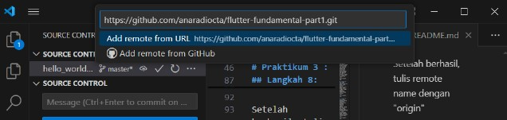

#                   LAPORAN PRAKTIKUM
#     Jobsheet - 5 : Aplikasi Pertama dan Widget Dasar Flutter
#               TUGAS PEMROGRAMAN MOBILE
        Dibimbing oleh: Bapak Ade Ismail, S.Kom., M.TI

                        Disusun oleh: 

                    Nama: Anaradi Octa Lavechia
                    NIM : 2241760007
                    KELAS : SIB - 3D
                    JURUSAN TEKNOLOGI INFORMASI
                    PRODI D-IV SISTEM INFORMASI BISNIS
                    POLITEKNIK NEGERI MALANG
                                2023

# Praktikum 1 : Membuat Project Flutter Baru
Selesaikan langkah-langkah praktikum berikut ini menggunakan editor Visual Studio Code (VS Code) atau Android Studio atau code editor lain kesukaan Anda.

## Langkah 1:
Buka VS Code, lalu tekan tombol Ctrl + Shift + P maka akan tampil Command Palette, lalu ketik Flutter. Pilih New Application Project.

## Langkah 2:
Kemudian buat folder sesuai style laporan praktikum yang Anda pilih. Disarankan pada folder dokumen atau desktop atau alamat folder lain yang tidak terlalu dalam atau panjang. Lalu pilih Select a folder to create the project in.

## Langkah 3:
Buat nama project flutter hello_world seperti berikut, lalu tekan Enter. Tunggu hingga proses pembuatan project baru selesai.

## Langkah 4:
Jika sudah selesai proses pembuatan project baru, pastikan tampilan seperti berikut. Pesan akan tampil berupa "Your Flutter Project is ready!" artinya Anda telah berhasil membuat project Flutter baru.

# Praktikum 2 : Menghubungkan Perangkat Android atau Emulator
Melanjutkan dari praktikum 1, Anda diminta untuk menjalankan aplikasi ke perangkat fisik (device Android atau iOS). Silakan ikuti langkah-langkah pada codelab tautan berikut ini.

https://developer.android.com/codelabs/basic-android-kotlin-compose-connect-device?hl=id#0

# Praktikum 3 : Membuat Repository GitHub dan Laporan Praktikum

Melanjutkan dari praktikum 2, silakan selesaikan langkah-langkah berikut ini.

## Langkah 1:
Login ke akun GitHub Anda, lalu buat repository baru dengan nama "flutter-fundamental-part1"

## Langkah 2:
Lalu klik tombol "Create repository" lalu akan tampil seperti gambar berikut.

## Langkah 3:
Kembali ke VS code, project flutter hello_world, buka terminal pada menu Terminal > New Terminal. Lalu ketik perintah berikut untuk inisialisasi git pada project Anda.

## Langkah 4:
Pilih menu Source Control di bagian kiri, lalu lakukan stages (+) pada file .gitignore untuk mengunggah file pertama ke repository GitHub.

## Langkah 5:
Beri pesan commit "tambah gitignore" lalu klik Commit (✔)

## Langkah 6:

Lakukan push dengan klik bagian menu titik tiga > Push

## Langkah 7:

Di pojok kanan bawah akan tampil seperti gambar berikut. Klik "Add Remote"

## Langkah 8:

Salin tautan repository Anda dari browser ke bagian ini, lalu klik Add remote

Setelah berhasil, tulis remote name dengan "origin"

## Langkah 9:

## Langkah 10:

## Langkah 11:

## Langkah 12:

<!-- # hello_world

A new Flutter project.

## Getting Started

This project is a starting point for a Flutter application.

A few resources to get you started if this is your first Flutter project:

- [Lab: Write your first Flutter app](https://docs.flutter.dev/get-started/codelab)
- [Cookbook: Useful Flutter samples](https://docs.flutter.dev/cookbook)

For help getting started with Flutter development, view the
[online documentation](https://docs.flutter.dev/), which offers tutorials,
samples, guidance on mobile development, and a full API reference. -->
